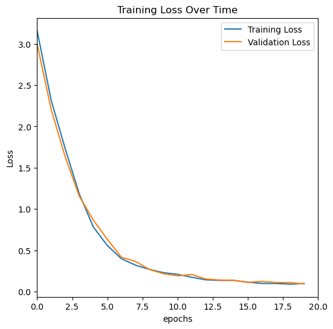
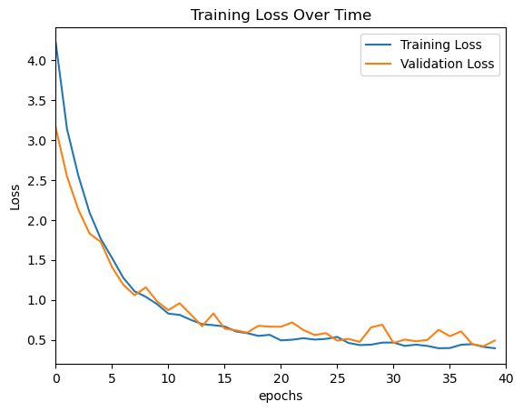

This is image classification model trained using convolutional neural networks to classify animal images.

## SETUP

Clone repository
```
git clone https://github.com/puravparab/animal_classifier.git
```

Run setup.sh
```
./setup.sh
```

Activate conda environment
```
conda activate <env name>
```

Install python packages to conda (if required):
```
conda install -y jupyter matplotlib numpy
conda install pytorch torchvision -c pytorch
```

Run jupyter notebook
```
cd notebooks
jupyter notebook
```

## DATASET

Download the dataset from kaggle into /datasets/animals directory

- 117 classes: https://www.kaggle.com/datasets/npurav/animals
- 151 classes: https://www.kaggle.com/datasets/npurav/animal-classification-dataset

## RESULTS

1. CNN Medium

- Params: 4,577,121
- Training Set: 138,420 images
- Number of classes: 117
- Accuracy: 97%
- Test Loss: 0.090



2. CNN Small

- Params: 449,125
- Training Set: 138,420 images
- Number of classes: 117
- Accuracy: 86%
- Test Loss: 0.4769




