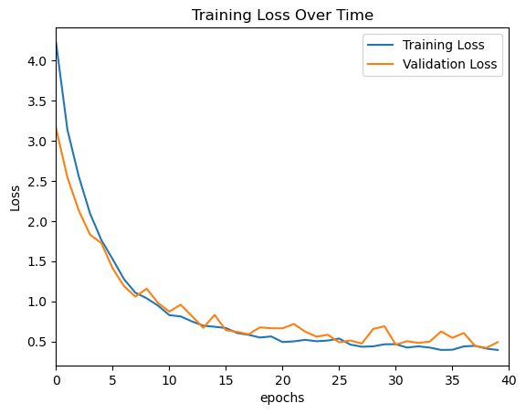

## SETUP

Clone repository
```
git clone https://github.com/puravparab/animal_classifier.git
```

Run setup.sh
```
./setup.sh
```

Activate conda environment
```
conda activate <env name>
```

Install python packages to conda (if required):
```
conda install -y jupyter matplotlib numpy
conda install pytorch torchvision -c pytorch
```

Run jupyter notebook
```
cd notebooks/pytorch
jupyter notebook
```

## DATASET

Download the dataset from kaggle into /datasets/animals directory
https://www.kaggle.com/datasets/npurav/animal-classification-dataset

## RESULTS

1. 450K CNN

- Params: 449125
- Training Set: 138420 images
- Number of classes: 117
- Accuracy: 86%
- Test Loss: 0.4769




